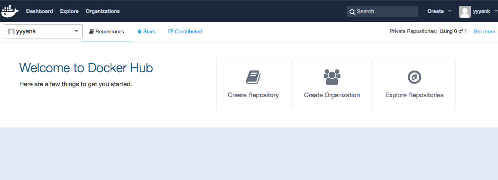
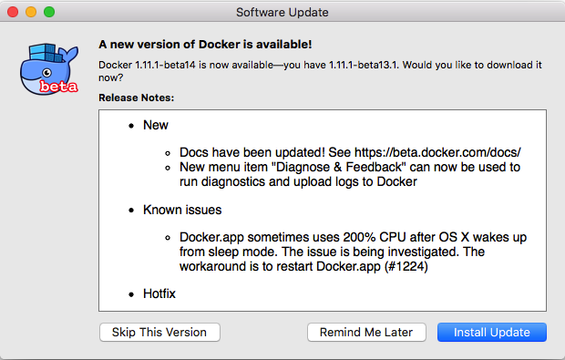
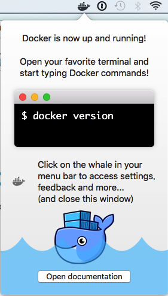

# dockerをmacで使ってみる  

[ここ](http://paiza.hatenablog.com/entry/docker_for_mac)を参考にしてみよう

docker for mac とやらがあるので使う(まだベータっぽい)。

* Docker Hubのアカウントが必要なようなのでアカウントを作成。





* Dockerのdmgファイルをダウンロード
* インストール

[Docker Hub](https://hub.docker.com/)  
[インストール元](https://beta.docker.com/docs/)

## tokenがない

docker for macのアプリをインストールし起動。  
そうするとtokenの入力を要求される。  
  
この時点ではtokenが発行されてないのでどうやら使えないようだ。  
tokenがメールで来るまで待つしかない。一ヶ月ぐらいかかるらしい。


## 他の方法

docker for macにこだわらないのであれば

    brew install docker

して

    brew install docker-machine

すれば良いと思う。あとはtoolboxとやらを取ってくれば色々遊べるはず。


## 気を取り直して

tokenくれと問い合わせしたらdocker.incが発行してくれた。  
早速インストール続行。  


drag and dropして  


tokenを入力して認証成功でニッコリ。




なにやらsoftwareのアップデートをし、



準備オッケーかな。  
  
hello-worldを試してみる。  

```
yank:$ docker run hello-world

Hello from Docker.
This message shows that your installation appears to be working correctly.

To generate this message, Docker took the following steps:
 1. The Docker client contacted the Docker daemon.
 2. The Docker daemon pulled the "hello-world" image from the Docker Hub.
 3. The Docker daemon created a new container from that image which runs the
    executable that produces the output you are currently reading.
 4. The Docker daemon streamed that output to the Docker client, which sent it
    to your terminal.

To try something more ambitious, you can run an Ubuntu container with:
 $ docker run -it ubuntu bash

Share images, automate workflows, and more with a free Docker Hub account:
 https://hub.docker.com

For more examples and ideas, visit:
 https://docs.docker.com/engine/userguide/
```


おっ。上手く言ったっぽい。


## Dockerコマンドを把握する

## DockerFileを把握する

## イメージを作ってみる
